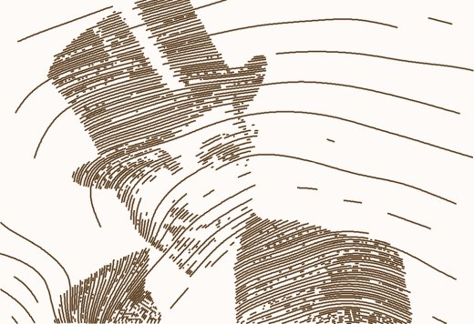
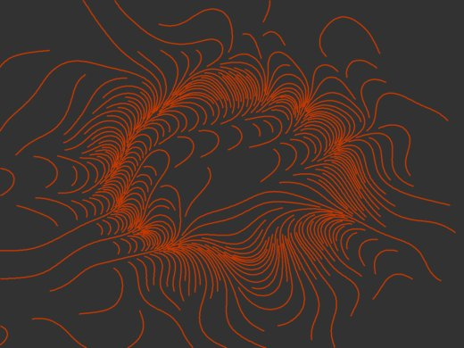

# Variable-density streamlines generator

This library produces aesthetically pleasing streamline visualizations of flow fields. Think of this like a wind map. We know the wind's direction at every point on a grid, and we want to overlay that data on a map using lines that always follow the wind's direction.

The tricky part in doing this is to create streamlines that are evenly spaced and preferably long. A good method to do this comes from Jobard and Lefer, who published it in their 1997 paper [Creating Evenly-Spaced Streamlines of Arbitrary Density](https://web.cs.ucdavis.edu/~ma/SIGGRAPH02/course23/notes/papers/Jobard.pdf). It was implemented in Javascript by Andrei Kashcha as the [streamlines](https://github.com/anvaka/streamlines) library; my library is derived directly from Andrei's work.

In the original Jobard-Lefer algorithm the density of streamlines is configurable, but it is uniform over the entire area. My derived algorithm lets you to control the streamlines' density through a second, arbitrary function. If the density is the brightness of pixels in an image, then this allows visualizing photos like this:



My focus with this library is not on data visualization but on generative art. Think of explorations like this image, which shows a Perlin noise field that is denser along a ring and lighter in the center and at the edges.




## Including the library

### Using from NPM

If your code has a package.json file, then the simplest way is the add the NPM package as a dependency and import the library as a module, like this:

**package.json**

```json
{
  "dependencies": {
    "adaptive-streamlines": "^1.0.0"
  }
}
```

**Top of Javascript source file**

```javascript
import {createStreamlineGenerator, Vector} from "adaptive-streamlines";
```

The [field-module](examples/field-module) example illustrates this.

### As a script

If you prefer to include the library as a `<script>` tag in your HTML file, you can download the bundle from the project's [latest release](https://github.com/gugray/adaptive-streamlines/releases) and include it the usual way. The bundle adds its exports to the global `window` object.

```html
<script defer src="adaptive-streamlines.js" type="module"></script>
```

The [field-include](examples/field-include) example illustrates this.

## Simple usage
  
The [examples](examples) folder contains several workig demos. Here's what you need to do to start generating your own streamlines:
  
- Define your flow field and density functions
- Define a callback that will receive the generated streamlines
- Create a streamline generator instance and provide the desired parameters
- Run the generator, either asynchronously or synchronously.

```javascript
import {createStreamlineGenerator, Vector} from "adaptive-streamlines";

function flowFun(pt) { ... return new Vector(vx, vy); }
function densityFun(pt) { ... return val; }
function lineAdded(points) { ... }

const slGen = createStreamlineGenerator({
  field: flowFun,
  density: densityFun,
  width: 1024,
  height: 768,
  minStartDist: 4,
  maxStartDist: 192,
  endRatio: 0.9,
  minPointsPerLine: 3,
  stepLength: 2,
  onStreamlineAdded: lineAdded,
});

await slGen.runAsync();
```

### Remarks

- The size of the illustrated area is defined by the `width` and `height` parameters. The functions provided through `field` and `density` receive a two-dimensional vector as an argument; the coordinates are 0 <= x < width and 0 <= y < height.
- There are no strict limits on the width and height you can choose, but in the background the algorithm uses a mask with a unit resolution. I.e., you cannot have streamlines that are closer than 1 to each other. If you use a size that makes sense as a pixel resolution you will be fine.
- The flow field function you provide must return either a normlized vector (whose length is 1), or a zero vector, or null. The latter two indicate a singularity in the flow field. Any streamline that reaches a singularity will simply stop there.
- The density function must return a value between 0 and 1. Think of this as the darkness of an area on a photo. 0 means black, and this will result in streamlines crowded densely together. 1 means white. Where the value is 1 there will be no streamlines at all. Values just under 1 will result in streamlines not getting very close to each other.
- `minStartDist` and `maxStartDist` correspond to the Jobard-Lefer algorithm's _dSep_ (separation distance) parameter. When a new streamline is seeded off an existing one, the starting point will be this distance away from it. In _adaptive-streamlines_ the distance of the new seed depends on the value of the density function at the examined location of the existing streamline. If the density there is 0, `minStartDist` will be used. If the density there is close to 1, `maxStartDist` will be used.
- `endRatio` is related to the original algorithm's _dTest_ (test distance) parameter. There it means how close sreamlines are allowed to get to each other as they grow; this is smaller than the minimum distance of their seed point. In _adaptive-stremlines_ this is not defined by an explicit value, but as a fraction of the starting distance derived from the density value, `minStartDist` and `maxStartDist`.
  - The expected range is 0 < `endRatio` < 1
  - If `endRatio` is close to 1, streamlines are not allowed to get very close to each other. This would correspond to a situation in Jobard-Lefer where _dSep_ is 10 and _dTest_ is 9.
  - If `endRatio` is close to 0, streamlines can get close to each other before they are terminated. This would correspond to a situation in Jobard-Lefer where _dSep_ is 10 and _dTest_ is 3.
